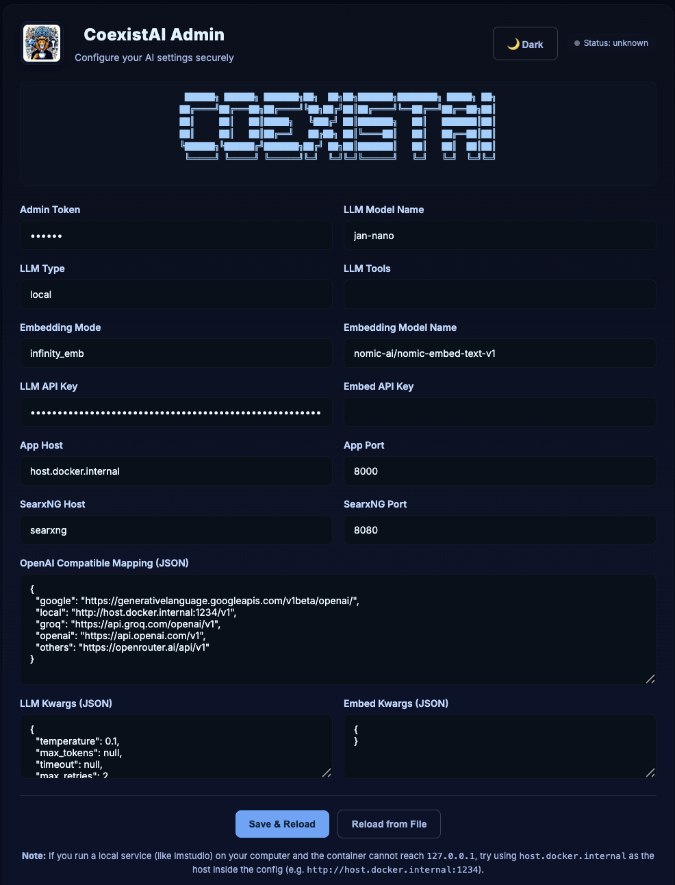

# CoexistAI — Docker Quickstart

### Short, step-by-step instructions for two ways to start CoexistAI. Pick either Method A (helper script) or Method B (direct Docker Compose).

## Prerequisites
- Docker Engine installed.

## Before you start (one-time)
1. Open a terminal and change into the repository folder:

```bash
cd /path/to/CoexistAI
```

2. Edit the .env file for keys and admin token (which will be used while editing model params):


## Method A — Helper script (recommended for beginners)
This script automates the compose start and waits until the app reports ready.

1. Run the helper (from repo root):

```bash
./quick_setup_docker.sh 
```
or 

```bash       # default timeout 300s
./quick_setup_docker.sh 600    # pass timeout in seconds (example: 600s = 10min)
```

   For subsequent starts, run the script again (it detects the existing image and skips building/installing).

2. What the script does (so you know what to expect):
- Checks if the Docker image 'coexistai-app' already exists; if yes, runs `docker compose up -d` (no build); if not, runs `docker compose up -d --build` to start containers detached.
- Polls `http://localhost:8000/status` every few seconds and prints a spinner.
- Exits with code 0 when the app reports `{"status":"ready"}`.
- Exits non-zero if the app reports `error` or the timeout is reached.

3. After the script finishes successfully, open:

- http://localhost:8000/admin



- By default ADMIN_TOKEN=123456, you can change it via .env

   This opens the Admin UI, where you can edit model configurations, API keys, and reload settings without rebuilding the container.

When to use Method A: you're new to Docker or want a simple way to wait until the app is ready.


## Method B — Direct Docker Compose (fast, manual)
1. Start the stack:

   - **First time** (builds the image):
     ```bash
     docker compose up -d --build
     ```

   - **Subsequent times** (uses existing image):
     ```bash
     docker compose up -d
     ```

   To stop: `docker compose down`

   To restart: `docker compose restart`

2. Wait for ready signal in terminal where you ran docker compose, then open the admin UI:

- http://localhost:8000/admin

3. Verify status from the host:

```bash
curl http://localhost:8000/status
# expected JSON: {"status":"starting"} or {"status":"ready"}
```

4. Edit configuration:
- Use the Admin UI `/admin` and click "Save & Reload" to apply changes without rebuilding.
- Or from the host (curl):

```bash
curl -X POST -H "X-Admin-Token: $ADMIN_TOKEN" http://localhost:8000/admin/reload-config
```

When to use Method A: you prefer to run compose directly and watch logs yourself.

Secrets (recommended pattern)
- Do not store API keys in the repo. Use `.env` or file-backed secrets.
- Recommended: create `CoexistAI/config/keys/` on the host, place key files there, and mount that folder into the container. Reference them in `config/model_config.json` with `llm_api_key_file` / `embed_api_key_file`.

Quick troubleshooting
- App unreachable? Check app logs:

```bash
docker compose logs app --tail=200
```

- App timed out in `quick_setup_docker.sh` or reports `error`? Inspect logs and increase timeout:

```bash
docker compose logs app --tail=400
./quick_setup_docker.sh 600
```

- Long model downloads or HF errors: allow more time on first start or mount `artifacts/` (HF cache) into the container to avoid repeated downloads.

Helpful commands

```bash
# Check status
curl http://localhost:8000/status

# Ask app to reload config (from host)
curl -X POST -H "X-Admin-Token: $ADMIN_TOKEN" http://localhost:8000/admin/reload-config

# Follow logs interactively
docker compose logs -f app --tail=200
```

